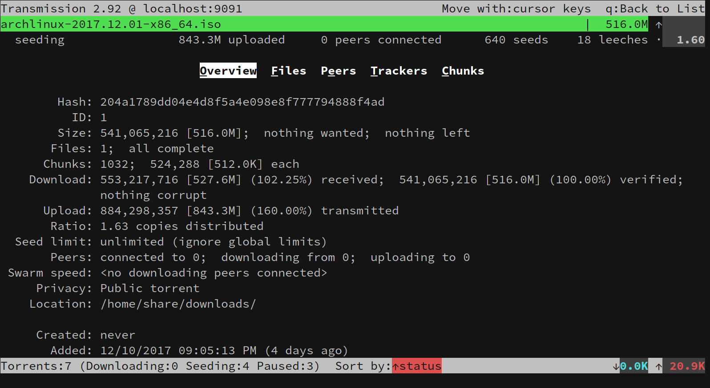

## About

A console client for the BitTorrent client
[Transmission](http://www.transmissionbt.com/ "Transmission Homepage").

`tremc` is the python3 fork of [transmission-remote-cli](https://github.com/fagga/transmission-remote-cli).

## Requirements

Python 3.2

### Optional Modules

- python-GeoIP or python-GeoIP2: Guess which country peers come from.
- [python-pyperclip](https://pypi.org/project/pyperclip/): Copy magnet links to the system clipboard. You will also need either xclip on linux or pbcopy on OS X for this to work.

## Usage

### Connection information

Authentication and host/port can be set via command line with one
of these patterns:

`$ tremc -c homeserver`

`$ tremc -c homeserver:1234`

`$ tremc -c johndoe:secretbirthday@homeserver`

`$ tremc -c johndoe:secretbirthday@homeserver:1234`

You can write this (and other) stuff into a configuration file:

`$ tremc -c johndoe:secretbirthday@homeserver:1234 --create-config`

No configuration file is created automatically. You must create it with the
`--create-config` option.

If you don't like the default configuration file path
~/.config/tremc/settings.cfg, change it:

`$ tremc -f ~/.tremc --create-config`

### Command line options
* **`--version`**
Show version number and exit

* **`-h --help`**
Show usage information and a list of options

* **`-s --ssl`**
Use SSL to connect to the server.

  Default: don't use SSL

* **`--create-config`**
Create configuration file with default values.

  *NOTE:* A config file won't be created unless you provide this option at
least once. After that, it is rewritten whenever tremc exits.
* **`-f CONFIGFILE --config=CONFIGFILE`**
Set path to configuration file. if not creating a config file, and CONFIGFILE
does not exist (and contains no slashes), the config directory is also
searched for CONFIGFILE or CONFIGFILE.cfg.

  Default: ~/.config/tremc/settings.cfg

* **`-l, --list-actions`**
List available actions for key mapping.

* **`-k, --list-keys`**
List key names for key mapping.

* **`-n --netrc`**
Get authentication info from ~/.netrc.

* **`-X, --skip-version-check, --permissive`**
Proceed even if the running transmission daemon seems incompatible, or the terminal is too small.

* **`-p PROFILE --profile PROFILE`**
Select profile to use.

* **`-r --reverse-dns`**
Toggle display of reverse DNS of peers addresses.

  Default: off, but may be set in the config file.

* **`-d [LOGFILE] --debug [LOGFILE]`**
Enable debugging messages to stderr, or to LOGFILE if provided.

### Main user interface

`tremc` has two display modes: torrents list view and torrent details view.
In details view there are five tabs: overview, files, peers, trackers and chunks.

In list view, as well as in the files and trackers one item may be focused.
In list view and the files tab, a set of items may also be selected.

`tremc` is controlled by the keyboard. In the following list of key bindings case matters and ^ is used for the Control key.

#### Keys that work in both modes:
* Vertical movement keys:
  * Up, k, ^p		: move one line up
  * Down, k, ^n		: move one line down
  * PageUp, ^b		: move one screen up
  * PageDown, ^f	: move one screen down
  * Home, g 		: move to top
  * End, G	 		: move to bottom

  In list view, files tab and trackers tab, the focused item is moved, and the display scrolled to keep the focused item viewable.

  In the other tabs, only the display is scrolled if there is more than one screen to display.

* ?, F1	: Display help window
* ^w	: Quit `tremc` immediately
* X		: Send the quit command to the daemon
* S		: Show session statistics
* O		: Show `tremc` information and options
* M 	: Copy magnet link to clipboard (if the pyperclip module is available)
* B		: Set labels (labels require transmission 3.0 or later) +
* b		: Add label +
* ^l	: Remove label +
* F		: Rename focused file (or torrent, if no file is focused)
* N		: Start torrent now +
* p		: Pause/unpause torrent +
* P		: Pause/unpause all torrents
* n		: Reannounce torrent +
* v, y	: Verify torrent +
* \-		: Decrease torrent priority +
* \+		: Increase torrent priority +
* \*		: Toggle torrent's honors session limits flag +
* D		: Modify torrent download bandwidth limit +
* U		: Modify torrent upload bandwidth limit +
* d		: Modify global download bandwidth limit
* u		: Modify global upload bandwidth limit
* L		: Set seed ratio of torrent +
* m		: Move torrent to another directory +
* R, Shift+Del	: Remove torrent and delete its data
* `     : Open menu of actions with not keyboard bindings

An action marked with + acts on:
* Viewed torrent in details mode
* Selected torrents in list mode
* Focused torrent in list mode if no torrents are selected

#### Torrent details mode keys
* Esc	: Unfocus file if a file is focused, otherwise return to torrents list mode
* q, Backspace	: Return to torrents list mode
* Enter	: View file
* |     : Enter command to view file
* x     : Show file information window
* J		: Move to next directory in file list
* K		: Move to previous directory in file list
* Space	: Select/unselect file and move to next file
* a		: In files tab: select/unselect all files. In trackers tab: add a tracker to torrent
* A		: Select/unselect all files in directory
* V		: Visually select files
* ,		: Select files matching text
* <		: Select files matching regular expression
* i		: Invert selection
* C     : Rename torrent directory containing focused file. Will not rename top directory.
* r, Del	: Remove tracker
* Tab	: Move to next tab
* Shift-Tab	: Move to previous tab
* Right,l	: Increase priority of focused or selected files. Move to next tab if no file is selected or focused.
* Left,h	: Decrease priority of focused or selected files. Move to previous tab if no file is selected or focused.
* o		: Move to overview tab
* f		: Move to files tab
* e		: Move to peers tab
* t		: Move to trackers tab
* c		: Move to chunks tab
* /		: Search for files matching pattern
* .		: Search for files matching regular expression
* s		: File sort menu

#### Torrents list mode keys
* q		: Quit `tremc`
* Esc	: Unfocus torrent
* Enter, Right, l	: Enter torrent details mode for current torrent
* o		: Server options dialog
* Space : Select/unselect torrent and move to next torrent
* A		: Select/unselect all torrents
* ,		: Select torrents matching text
* <		: Select torrents matching regular expression
* i		: Invert selection
* s		: Torrent sort order menu
* f		: Torrent filter menu
* T		: Add torrent filter
* I		: Edit torrent filters
* ~		: Invert filters action
* t		: Toggle turtle mode
* J		: Move torrent down in queue
* K		: Move torrent up in queue
* r, Del	: Remove torrent, keeping data
* ^r	: Remove selected torrents, keeping data
* e		: Profile selection menu
* C		: Change betweem 1,2,3 lines per torrent modes
* a		: Add torrent dialog
* ^a	: Add torrent (in paused mode) dialog
* /		: Search for torrents matching pattern
* .		: Search for torrents matching regular expression

### Dialog windows
Various dialog windows can be opened While using the program. At any time, ^w quits the program.

In all text input dialogs, edit text with Left, Right, Home, End, Backspace, Del.
* Information windows (session statistics, key bindings):
  * Escape closes the windows
  * Space shows next page if there is more to display.
* Confirmation windows

  Press y/n to accept or cancel. Left/Right/Tab/Shift-Tab move highlight, Enter accepts highlighted choice.
* Options window

  Select option to modify by pressing the highlighted letter. Esc to close window.
* Numeric input

  Use numeric keys (and period for non integer values).

  Use Left/h (Right/l) to decrease (increase) the number by 10.

  Use Down/j (Up/k) to decrease (increase) the number by 100.

  For floating points the small increase is 0.1 (instead of 10) and the large increase is 1.
* Search window: Enter pattern or regular expression to search. Search happens while typing. If none found, the input line shows this by changing color. Keys:
  * Esc closes the window.
  * Tab completes typed pattern by searched items (files/torrents).
  * Up/Down cycle through history.
  * Enter moves focus to next match.
  * ^r moves focus to previous match.
* Selection window: Enter pattern or regular expression to search. Then
  * Esc closes the window without modifying selection.
  * Tab completes typed pattern by searched items (files/torrents).
  * Up/Down cycle through history.
  * Enter selects matching files/torrents.
  * ^r adds matching files/torrents to selection.
  * ^t selects matching files/torrents only from currently selected.
* Sort menu

  Select sorting key by pressing the highlighted letter, or moving the selection with Up/Down and pressing Enter. Pressing the capital letter or pressing Backspace after highlighting the desired option select reversed filter (satisfied if the condition is not met).

  Selecting reverse reverses the current sorting order.

  Pressing Esc leaves sort order unchanged.
* Filter menu

  Select filter by pressing the highlighted letter, or moving the selection with Up/Down and pressing Enter. Pressing the capital letter or pressing Backspace after highlighting the desired option select reversed filter (satisfied if the condition is not met).

  Some filters open further window to enter or select the filter parameter.

  Selecting reverse reverses the current sorting order.

  Pressing Esc leaves filter unchanged.
* Filters lists edit

  Filtering is done by a list of sublists of filters. For an item to satisfy the list, it has to satisfies all filters in at least one sublist (DNF).

  Move the cursor by using the arrow keys, d to remove marked filter, f to edit marked filter (including empty one).

  Enter to accept modified list, Esc to leave window without modifying list of filters.

## Configuration file
By default the configuration file is called settings.cfg in the XDG configuration directory for `tremc`. With default XDG configuration, this will be `~/.config/tremc/settings.cfg`.

The configuration file is in .ini format (section names in square brackets, key = value, comments start with # or ;).

The following sections are read:

* [Connection]

  Keys are username, password, host, port, path, ssl (boolean).
* [Sorting]

  The key 'order' determines torrents sort order. Possible values are: name, addedDate, percentDone, seeders, leechers, sizeWhenDone, status, uploadedEver, rateUpload, rateDownload, uploadRatio, peersConnected, downloadDir, mainTrackerDomain.
* [Filtering]

  Keys are invert (boolean) and filter with possible values: uploading, downloading, active, paused, seeding, incomplete, verifying, private, isolated, tracker, regex, location, selected, honors, label. The filters tracker, regex, location, label need a parameter, so cannot be set in this way.
* [Misc]

  Keys are
  * lines_per_torrent, value between 1 and 3.
  * torrentname_is_progressbar (boolean).
  * file_viewer, name of program to run for viewing a file.

    The string %%s is replaced by the file name.
  * file_open_in_terminal (boolean).
  * rdns (boolean), the value True enables showing the reverse DNS of connected peers.
  * geoip2_database, The location of the Python-GeoIP2 database file. If this key does not exist, or does not point to a file, the database is also searched for in some commonly used locations.
  * cancel, List of keys that act as cancel key in dialog windows. Printable characters are allowed, but act as cancel key only when not entering text.

    Default is Escape, Break and q.
* [Colors]

  Allows for setting (some of) the interface colors.

  The format of a color is 'fg:color,bg:color', where each color is one of the
  eight curses colors, or default.

  Allowed elements are header, footer, title_seed, title_download, title_idle, title_incomplete, title_verify,
  title_paused, title_error, download_rate, upload_rate, eta+ratio, filter_status, multi_filter_status, 
  window, dialog, dialog_important, file_prio_high, file_prio_normal, file_prio_low, file_prio_off.

  Note that what the colors mean actually depends on the terminal. In some
  cases 'white' is darker then the white that the terminal displays, and
  similarly, 'black' is lighter. Setting 'default' selects the respective
  background or foreground coloe of the terminal.

  The top and bottom status lines (header, footer, filter_status, multi_filter_status) and the dialog window
  (window, dialog, dialog_important) are displayed using inverse mode, so the fg and bg
  are exchanged.
* [Profiles]

  The key is `profile\<name\>`. The value is `<filters>#=<sort>`

  <sort> is the name of the torrent sort order, preceded by : for reversed
  order.

  <filters> is `<filters.1> #& ... #& <filters.n>` (the separators are space, hash, ampersand space

  Each <filters.i> is of the format `<filter.1>#=<param.1>#=...#=<filter.k>#=<param.k>`

  <filter.j> is the name of a torrent filter, preceded by : for inverted. <param.j>
  is the parameter of the filter if needed, it is ignored otherwise. <param.j> may be empty, but the separators must appear.

  A torrent satisfies a list of filters if for at least one of the <filters.i>, it satisfies each <filter.j>.
* [CommonKeys], [DetailsKeys], [ListKeys]

  Map keys to actions. ListKeys section is for keys pressed in torrent list display, DetailsKeys for torrent details display, and CommonKeys for both.

  The format is key = action.

  A list of action is available by running `tremc -l`.

  Key names are: letters (case sensitive), a_ for ^a, etc. Symbols (comma, semicolon, etc.) are denoted by their name.

## Calling transmission-remote

tremc forwards all arguments after '--' to transmission-remote.
This is useful if your daemon requires authentication or doesn't listen on the
default localhost:9091.
tremc reads HOST:PORT and authentication from the config file and forwards them
to transmission-remote, along with your arguments.

Some examples:

`$ tremc -- -l`

`$ tremc -- -t 2 -i`

`$ tremc -- -as`

### Add torrents

If you provide only one command line argument and it doesn't start with '-',
it's treated like a torrent file/URL and submitted to the daemon via
transmission-remote. This is useful because you can instruct Firefox to open
torrent files with tremc.

`$ tremc http://link/to/file.torrent`

`$ tremc path/to/some/torrent-file`

## Screenshots

## Copyright

Released under the GPLv3 license, see [COPYING](COPYING) for details.

## Contact

Feel free to request new features or provide bug reports.
https://github.com/tremc/tremc
